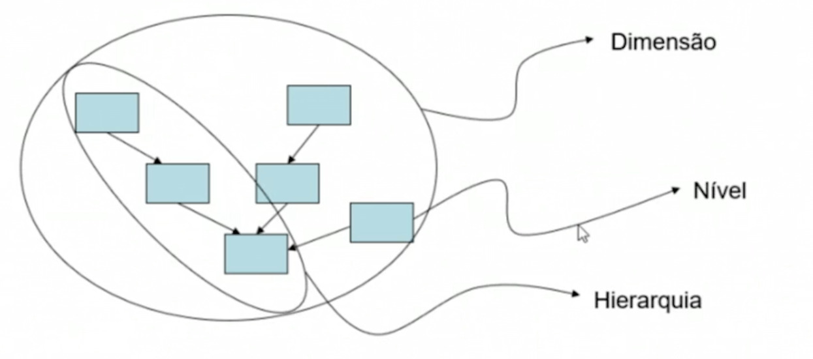
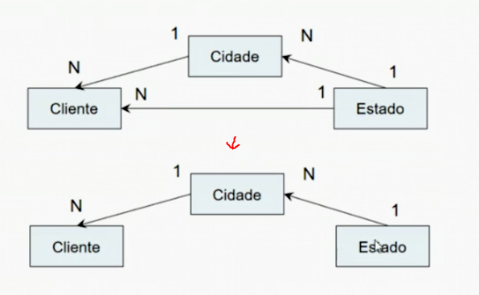
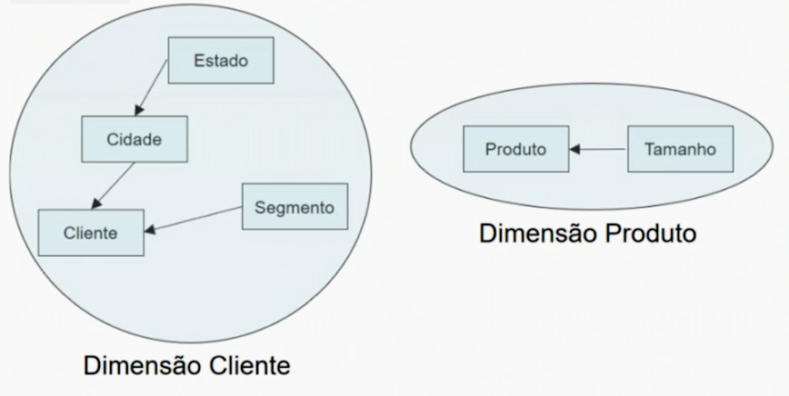
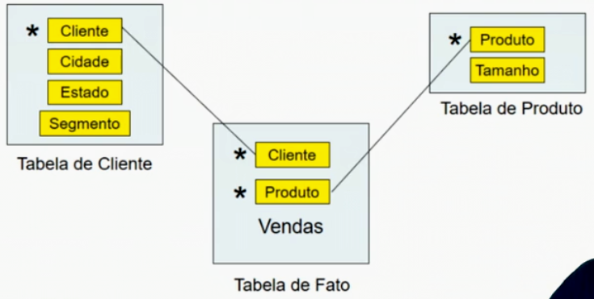
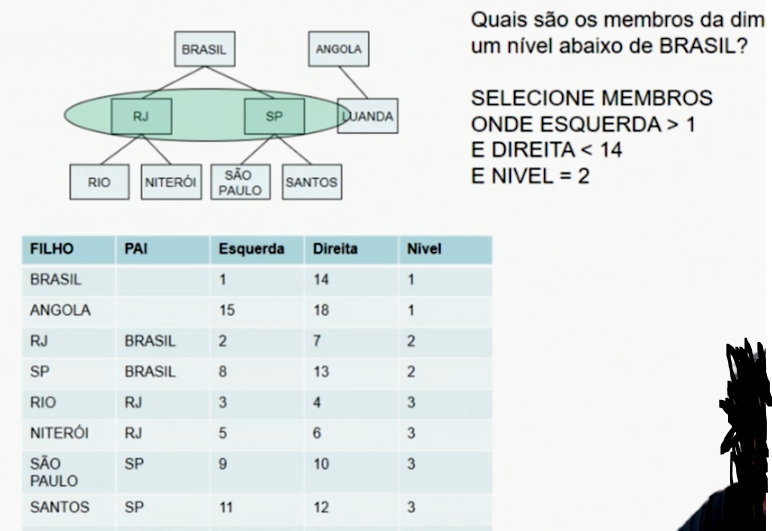

# Datawarehouse

Visa solucionar os seguintes problemas:
- Diversos problemas podem ocorrer quando não tomamos cuidado em extrair informações das empresas;
- Temos departamentos que olham valores dos mesmos indicadores de maneiras distintas;
- Diferentes formas de agregação dentro da empresa;
- Sistemas de informação que não se falam também é um problema muito comum.
    
Como?
Fornecendo informações gerenciais na tomada de decisões

## Caracteristicas do Datawarehouse

- Funciona separado da estrutura operacional da empresa
- Integração de diversas fontes de dados. (independente de tipo, formato ou origem interna ou externa)
- Implementeção das regras de negócio (definir o conceito utilizado para cada termo)
- Não possui obrigacao fiscal ou de impostos, entao pode ser modelado a gosto da empresa. 
- Limpeza de dados
- Análise ao longo do tempo (estudo do dado)

## Iniciando projeto em uma empresa

O que a empresa faz?

Quais sao os principais indicadores?

Como os executivos tomam suas decisões?

Baseado em que informações?

->

O que quero analisar? (que tipo de informação eu preciso? -> Indicador/Medida ou variavel)

Como quero analisar? (de que maneira eu quero ver essa informação? -> Dimensão)

Exemplo:

Vendemos R$ 10000,00 em Notebooks em Março.

## Matriz Dimenção X Indicador

Linhas - Indicador:
- Vendas
- Custos
- Lucro
- ...
  

Colunas - Dimensão:
- Cliente
- Empresa
- Tempo
- ...

|      |Cliente|Empresa|Tempo|
|---   |---    |---    |---  |
|Vendas| x     | x     |x    |
|Custos| x     | x     |x    |
|Lucro | x     | x     |x    |

x -> cruzamento que faça sentido

nem sempre todos os indicadores vao cruzar com todas as dimensoes

exemplo:

- Posso ver Vendas por Cliente e por Produto
- Custo de Materia Prima, posso ver por Produto, e NÃO por cliente (regra varia por lógica de negócio)

|               |Cliente|Produto|
|---            |---    |---    |
|Vendas         | x     | x     |
|Custo Mat Prima|       | x     |

## Projetar Tabelas

Datawarehouse é um banco de dados, composto de tabelas, campos, registros, indices, chaves primarias e enstrangeiras

Unico diferencial é que o desenho do datawarehouse em suas caracteristicas sera feito pela matriz de dimensão indicador.

As Tabelas são divididos em 2 grandes grupos:
- Tabelas de dimensão -> uma tabela para cada dimensao
- Tabelas de fato -> Grava uma ocorrencia, no momento tempo, quando algo ocorre com determinado indicador, é registrado aqui.

Como descobrir as tabelas de fato a partir da matriz de dimensao indicador?

Uma tabela de fato é o conjunto de dimensoes e indicadores que possuam os mesmo cruzamentos. Exemplo:

||Dim1|Dim2|Dim3|Dim4|
|---|---|---|---|---|
|Ind1|a|a|a|a|
|Ind2|a|a|a|a|
|Ind3||b|b|b|
|Ind4||b|b|b|
|Ind5|c|c|c||
|Ind6|c|c|c||

- Fato A = Indicador1,2 e Dim1,2,3,4 
- Fato B = Indicador3,4 e Dim2,3,4 
- Fato C = Indicador5,6 e Dim1,2,3

Cada fato é uma tabela, e todas as Dimensoes devem ser uma Chave Primaria de outra tabela 

## Detalhes de uma Dimensão
- E um conjunto de entidades se relacionando, dando origem a uma Dimensão
- Cada entidade é um nível e cada nível possui um atributo.

Dimensão > Hierarquia > Nível > Atributo

### Exemplo

#### Pedido

*'Quero saber as vendas por cliente, cidade, estado, segmento, tamanho e produto'*

- Indicador - Vendas
- Dimensão - (Cliente, Cidade, Estado, Segmento, Tamanho, Produto)

#### Tabela de Matriz

|      |CLIENTE|CIDADE|ESTADO|SEGMENTO|TAMANHO|PRODUTO|
|---   |---    |---   |---   |---     |---    |---    |
|Vendas| x     | x    | x    | x      | x     | x     |

#### Análise do relacionamento

Qual a relação entre estas entidade? (1:1, 1:n, n:n) 

|        |CLIENTE|CIDADE|ESTADO|SEGMENTO|TAMANHO|PRODUTO|
|---     |---    |---   |---   |---     |---    |---    |
|CLIENTE | x     | x    | x    | x      | x     | x     |
|CIDADE  | 1:n   | x    | x    | x      | x     | x     |
|ESTADO  | 1:n   | 1:n  | x    | x      | x     | x     |
|SEGMENTO| 1:n   | n:n  | n:n  | x      | x     | x     |
|TAMANHO | n:n   | n:n  | n:n  | n:n    | x     | x     |
|PRODUTO | n:n   | n:n  | n:n  | n:n    | 1:n   | x     |

- Relacoes de 1:n viram uma seta, como Cidade 1:n Cliente vira |CIDADE| -> |CLIENTE|
- Relações de 1:n em sequencia viram uma hierarquia 
- Relacoes de 1:1 viram atributo

Como escolher entre hierarquia de 2 niveis, (tabela separada), ou atributo(coluna)?
- Devemos escolher como atributo quando tempos poucos tipods de valores ou sem codigos - pequeno, medio, grande
- Valores unicos - CPF, Telefone, etc

#### Resultado

Nova tabela Matriz

|      |CLIENTE|PRODUTO|
|---   |---    |---    |
|Vendas| x     | x     |

Estrutura dimensão Cliente
- 2 Hierarquias -> Geografica e Segmento
- 4 Níveis -> Cidade, Estado, Segmento e Cliente
- Nivel folha - chave primaria da tabela de dimensao -> Cliente
  

## Modelos DW

### Modelo Estrela
- Desnormalizado
- nao economiza espaco

### Modelo Floco de neve
- economiza espaco
- Cada nivel é uma tabela, Atributos podem ser apenas uma coluna na tabela de fato

## Dimensões irregulares
- é usado quando nao saberemos quantos niveis teremos e nem como serao as relacoes entre os seus membros;
- planos contabeis

### Tabela Pai/Filho

## Sistemas

t.1	t.2	t.3
---------------------carro    
 -> -> -> -> -> ->   

### Sistema transacional

t.3
----------carro

### Sistema gerencial

t.1
carro----------

t.2
-----carro-----

t.3
----------carro

## Diemensão Tempo

No Data Warehouse o Tempo é uma das dimensões mais importantes, determina as ocorrencias dos indicadores dentro da tabela de fato, 
Toda tabela de fato deve possuir pelo menos um membro da dimensão de tempo 

##### Granularidade

Menor grão da dimensão tempo associado a uma ocorrencia (diferenca entre os registros ex: 1hora, 1dia)

##### Periodicidade

Menor grão da dimensão tempo onde é feito uma medicao (como é lido)

###### Exemplo

Conta de luz, onde a medição é feita a cada segundo (Periodicidade de 1segundo) mas na conta vem por dia (Granularidade de 1 dia)

## Tranformações 

##### Limpeza de Dados

|CIDADE   |CIDADE   |
|---      |---      |
|S. Paulo |SÃO PAULO|
|SAO PAULO|SÃO PAULO|
|SP       |SÃO PAULO|
|São paulo|SÃO PAULO|

##### LOOKUP

###### Origem

|CIDADE        |
|---           |
|RIO DE JANEIRO|
|SAO PAULO     |
|RIO DE JANEIRO|
|NITEROI       |
|SAO PAULO     |
|RIO DE JANEIRO|

###### Tabela lookup

|Cidade        |Lookup|
|---           |---   |
|RIO DE JANEIRO|1     |
|SAO PAULO     |2     |
|NITEROI       |3     |

###### Resultado

|CIDADE        |
|---           |
|1             |
|2             |
|1             |
|3             |
|2             |
|1             |

##### Funções

|ORIGEM             |CIDADE        |ESTADO|
|---                |---           |---   |
|RIO DE JANEIRO - RJ|RIO DE JANEIRO|RJ    |
|SAO PAULO - SP     |SAO PAULO     |SP    |
|SAO PAULO - SP     |SAO PAULO     |SP    |
|RIO DE JANEIRO - RJ|RIO DE JANEIRO|RJ    |

## ODS

Tabelas temporarias para efetuar transformações, são usadas quando temos um indicador com uma Peridiocidade menor que a granulidade

###### Exemplo

Todo dia dados são gravados na ODS, porem apenas no fim da semana que os dados sao gravados da ODS para o data warehouse e enteao a ODS é esvaziada

## ETL

- Extract (adquirir informação)
- Transform (tratar informação)
- Load (guardar informação

## OLAPs

- Online Analytical Process

- Mais Eficiente em uma busca que um banco de dado relacional 

- Ocupa mais espaço que um Banco relacional

- Não possuem tabelas, campos, registros

- Podemos separas diversos OLAPs por assuntos contanto que a fonte de dados seja somente o DW
 
### Modelagem logica das dimensões do data warehouse

|Tipo  |Produto     |
|---   |---         |
|Sucos |Suco laranja|
|Sucos |Suco maca   |
|Aguas |Agua sem gas|
|Aguas |Agua com gas|

|Tipo        |Cliente     |
|---         |---         |
|Supermercado|Super Princesa|
|Supermercado|Super Princesa|
|Lanchonete  |Hamburghuer 2 |
|Lanchonete  |Padaria Maria |

#### Passa a ser:

##### Dimensao Produtos

Sucos = Suco de laranja + suco de maca

Aguas = Agua com gas + agua sem gas   

Produtos = Sucos + Aguas

##### Dimensao Cliente

Supermercado = Super Princesa

Lanchonete = Hamburgueria 2 + Padaria Maria

Cliente = Supermercado + Lanchonete

### Matriz entre as 2 Dimensoes

|               |Super Princesa|Super Gigante|Hamburgueria 2|Padaria Maria|SuperMercado|Lanchonete|Clientes|
|---            |---           |---          |---           |---          |---         |---       |---     |
|Suco de Laranja|**100**       |**250**      |**0**         |**50**       |350         |50        |400     |
|Suco de Maca   |**200**       |**300**      |**300**       |**0**        |500         |300       |800     |
|Agua com Gas   |**150**       |**250**      |**70**        |**70**       |400         |140       |540     |
|Agua sem Gas   |**300**       |**100**      |**120**       |**120**      |400         |240       |640     |
|Sucos          |300           |550          |300           |50           |850         |350       |2380    |
|Aguas          |450           |350          |190           |190          |800         |380       |1180    |
|Produtos       |750           |900          |490           |240          |1650        |730       |2460    |

- Para 3 ou mais Dimensoes utilizamos um cubo, ou seja, varias fatias dessa matriz

### Esparsividade

Esparsividade = Numero de combinações reais / Numero de combinações possiveis

Quanto mais perto de 1 -> Mais denso o cubo OLAP

Ideal seria algo como 0.05

#### Tipos de OLAP

###### **M**OLAP - Multidimensional OLAP
- Todas as combinações ja calculadas previamente
- Consultas mais rapidas
- Criação mais demorada

 
###### **H**OLAP - Hibrido OLAP
- Alguma combinações foram caluladas previamente, e o resto é calculado na hora da consulta
- Cache: consultas são armazenadas, e a cada consulta realizada a próxima é mais eficiente
- Consultas mais demoradas que MOLAP
- Criaçao mais rapida que Molap

###### **R**OLAP - Relational OLAP
- Nenhuma combinação calculada
- Cache
- Consultas mais demoaradas que HOLAP
- Criaçao mais rapida que HOLAP

