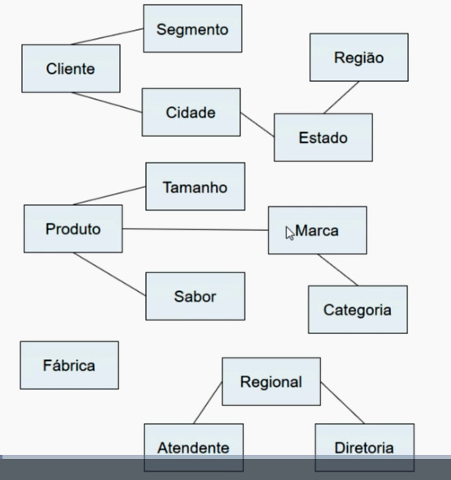

## Criando um Data Warehouse

### Indicadores necessarios

- Faturamento em R$
- Custo de frete em R$
- Imposto em R$
- Faturamento liquido em R$
- Custo fixo em R$
- Custo variavel em R$
- Margem em R$
- Unidades vendida
- Quantidade vendida em Litros
- Preço médio (R$/L)
- Meta de Faturamento em R$
- Meta de Custos em R$
- Meta de Margem em R$
- Variaçao Meta de Faturamento em R$
- Variacao Meta de Custos em R$
- Variacao Meta de Margem em R$

### Dimensoes necessarias

- Data (dia a dia)
- Cliente
- Segmento
- Estado
- Cidade
- Regiao
- Fábrica
- Produto
- Tamanho
- Sabor
- Marca
- Categoria
- Atendente
- Gerente de vendas
- Diretor de venda

### Dimensões

### Tabela Matriz

|                              | Tempo | Cliente | Produto | Fábrica | Vendas |
|------------------------------|:-----:|:-------:|:-------:|:--------:|:------:|
| Faturamento em R$            | x     | x       | x       | x        | x      |
| Custo de frete em R$         | x     | x       | x       | x        |        |
| Imposto em R$                | x     | x       | x       | x        | x      |
| Custo fixo em R$             | x     |         |         | x        |        |
| Custo variavel em R$         | x     | x       | x       | x        | x      |
| Unidades vendida             | x     | x       | x       | x        | x      |
| Quantidade vendida em Litros | x     | x       | x       | x        | x      |
| Meta de Faturamento em R$    | x     | x       | x       |          | x      |
| Meta de Custos em R$         | x     |         | x       | x        |        |

#### Fato 1

|                              | Tempo | Cliente | Produto | Fábrica | Vendas |
|------------------------------|:-----:|:-------:|:-------:|:--------:|:------:|
| Faturamento em R$            | x     | x       | x       | x        | x      |
| Imposto em R$                | x     | x       | x       | x        | x      |
| Custo variavel em R$         | x     | x       | x       | x        | x      |
| Unidades vendida             | x     | x       | x       | x        | x      |
| Quantidade vendida em Litros | x     | x       | x       | x        | x      |

#### Fato 2

|                              | Tempo | Cliente | Produto | Fábrica | Vendas |
|------------------------------|:-----:|:-------:|:-------:|:--------:|:------:|
| Custo de frete em R$         | x     | x       | x       | x        |        |

#### Fato 3

|                              | Tempo | Cliente | Produto | Fábrica | Vendas |
|------------------------------|:-----:|:-------:|:-------:|:--------:|:------:|
| Custo fixo em R$             | x     |         |         | x        |        |

#### Fato 4 

|                              | Tempo | Cliente | Produto | Fábrica | Vendas |
|------------------------------|:-----:|:-------:|:-------:|:--------:|:------:|
| Meta de Faturamento em R$    | x     | x       | x       |          | x      |

#### Fato 5

|                              | Tempo | Cliente | Produto | Fábrica | Vendas |
|------------------------------|:-----:|:-------:|:-------:|:--------:|:------:|
| Meta de Custos em R$         | x     |         | x       | x        |        |

### Regras

- Faturamento liquido em R$ = Faturamento - Custo Frete - Imposto
- Margem em R$ = Faturamento liquido - Custo Fixo - Custo variavel
- Preço médio (R$/L) = Faturamento / Vendido em L
- Variaçao Meta de Faturamento em R$ =  ((Fat. Liquido / Meta Faturamento) -1) X 100
- Variacao Meta de Custos em R$ = (((Custo Fixo + Custo variavel)/ Meta do custo) -1) X 100
- Variacao Meta de Margem em R$ = ((Margem/(Meta Fat. - Meta de Margem)) -1) X 100

