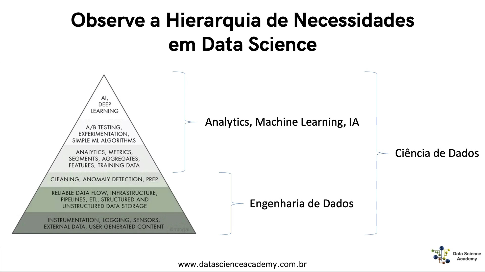

# Cap1

## O que é Engenharia de Dados?

- Um conjunto de técnicas etapas processos e procedimento que permitem pegar os dados na for    ma bruta e entregar os dados no formato utilizavel

### GPT

Engenharia de dados é um conjunto de práticas e técnicas que envolvem a criação, manutenção e utilização de arquiteturas de dados e sistemas de processamento de dados em larga escala. É uma disciplina que abrange várias áreas, como ciência da computação, estatística, matemática, engenharia de software, banco de dados, análise de dados e visualização de dados.

O principal objetivo da engenharia de dados é fornecer um ambiente eficiente e escalável para a coleta, armazenamento, processamento e análise de grandes quantidades de dados. Isso envolve a definição de estruturas e formatos de dados, o desenvolvimento de sistemas de gerenciamento de dados, a implementação de soluções de segurança e privacidade de dados e a construção de pipelines de processamento de dados para transformação e análise de dados.

A engenharia de dados é uma disciplina fundamental para a criação de soluções de big data, machine learning, inteligência artificial e análise de dados em geral.

## Hierarquia de necessidades em DS

##### O que é Data-Driven?

A tradução literal de "data-driven culture" seria "cultura orientada por dados". Isso significa que as decisões e ações são baseadas em dados concretos, em vez de intuição ou opiniões pessoais. É uma abordagem que valoriza a coleta, análise e interpretação de dados para orientar o pensamento crítico e a tomada de decisões em todos os níveis de uma organização. Em uma cultura data-driven, os dados são usados para identificar tendências, oportunidades, riscos e áreas de melhoria, e são fundamentais para o planejamento estratégico e operacional.

