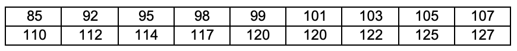

# FIAP - Faculdade de Informatica e Administracao Paulista
### Disciplina: Statiscal Computing With R
### Prof. Reinaldo Borges Junior
### PS - Prova Semestral
~~~
RM 94199 - Matias Cornelsen Herklotz
RM 93821 - Gustavo Jordão Santos 
RM 94026 - Daniel Faria de Barros
~~~

## Questão 1
~~~
(1) Considere que uma escola tem trˆes provas e as notas obtidas por 9 alunos s˜ao
guardadas nos seguintes vetores:
prova1< −c(8,9,5,6,7,8,8,8,5)
prova2< −c(2,3,4,3,6,4,2,9,5)
prova3< −c(1,6,2,9,1,10,2,9,2)
Encontre a alternativa CORRETA:

a) prova1[prova1>7] resulta apenas nos alunos com que tiveram nota 8 na primeira
prova.

b) prova2[prova2==7] resulta em dois elementos.

c) prova3[c(2,4,6)] resulta em as notas pares.

d) length(prova2[prova2!=4]) informa que temos 7 pessoas que tiraram nota diferente de
4 na prova 2.
~~~
### Resposta D:
~~~
a) - False
b) - False
c) - False
d) - True
~~~

## Questão 2
~~~
(2) Considere os comandos a seguir (nesta ordem):
cadastro <- matrix( c(NA, NA, NA, NA), nrow = 3, ncol = 4, dimnames = list(NULL,
c(”Nome”, ”Idade”, ”Cidade”, ”Telefone”)))
cadastro[1,] <- c(”Maria das Dores”, 56, ”Sao Paulo”,3025-111)
cadastro[2,] <- c(”Jose Anıbal”, 40, ”Santos”,3333-012)
Indique a alternativa correta.

a) A primeira linha de comando cria uma matriz com 3 colunas e 4 linhas contendo
Nome, Idade, Cidade e Telefone de Maria, Jose e Pedro.

b) Ao final de tudo, a primeira coluna da matriz ”cadastro” sugere ser uma variavel
numerica (quantitativa).

c) Os comandos cadastro[1,] e cadastro[2,] criam todos os dados a serem preenchidos nas
colunas da matriz ”cadastro”.

d) cadastro[,2:4] resulta nas Cidades e nos Telefones dos indivıduos cadastrados.

e) Nenhuma das alternativas.
~~~
### Resposta E:
~~~
a) - False
b) - False
c) - False
d) - False
e) - True
~~~

## Questão 3
~~~
(3) Com base no comando a seguir:
A <- array(10:20,dim=c(3,2,3))

a) A[,,1] acessa a primeira linha da primeira matriz do array.

b) A[,2,] acessa as segundas colunas de todas as matrizes do array.

c) A[1,,3] acessa a primeira coluna da terceira mtriz do array.

d) A[1,1,2] acessa a primeira linha, segunda coluna da primeira matriz do array.

~~~

### Resposta B:
~~~
a) - False
b) - True
c) - False
d) - False
~~~

## Questão 4

~~~
(4) Um pesquisador interessado em avaliar o nıvel de ruıdo em um determinado cruzamento
movimentado da cidade, mediu o nıvel de ruıdo (em decibeis) durante 18 dias.
Os dados encontram-se abaixo.

~~~

~~~
a) Determine o rol destas medidas.

b) Determine a amplitude destas medidas.

c) Determine a media desta amostra.

d) Determine a moda desta amostra.

e) Determine a mediana desta amostra.

Interprete os resultados obtidos.
~~~

### Respostas:
~~~
a) 85,92,95,98,99,101,103,105,107,110,112,114,117,120,120,122,125,127
b) 127 - 85 = 42
c) 108,44
d) 120
e) (110+107)/2 = 108.5

Os dados ja estavam bem organizados,
com nenhum Dado Outlier, bem equilibrados, 
pois tem uma media bem proxima da mediana.
~~~

## Questão 5

~~~
(5) Dado o conjunto de observacoes de uma amostra, C = {100, 200, 300}, calcule:

a) A media desta amostra.
b) A variancia desta amostra.
c) O desvio padrao desta amostra.
d) O coeficiente de variacao desta amostra.

~~~

### Respostas:
~~~
a) 200
b) 10000
c) 100
d) 50

~~~