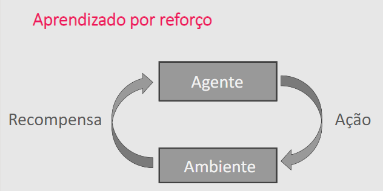
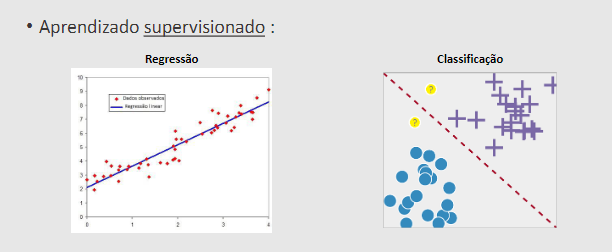
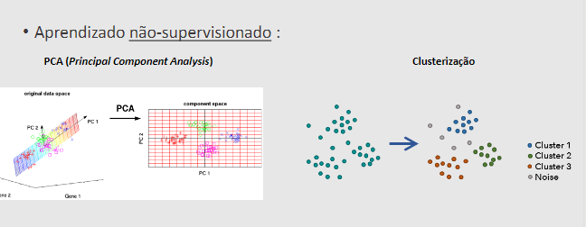

# Machine Learning

## Abordagens de aprendizagem 

- Supervisionada (usa labels) labels -> Exemplo/Modelo
    - Dados + labels -> MODELO => resposta -> a resposta acertou o label? 

- Não-supervisionada (NÃO usa labels)

    - Dados  -> MODELO -> resposta -> como eu sei se está correta?
- Por reforço:

## Tipos de modelagem: Case
- Análise descritiva = olhando o passado
- Análise preditiva = prevendofuturo
- Análise prescritiva = análises que  recomendam ações a serem tomadas.

