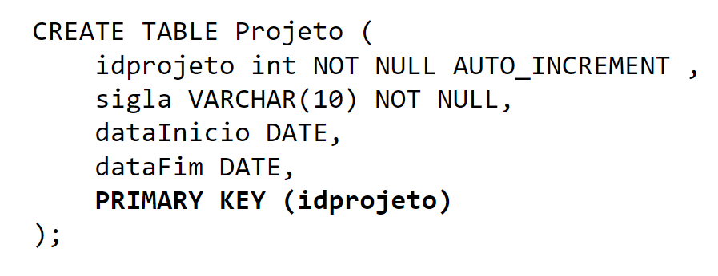
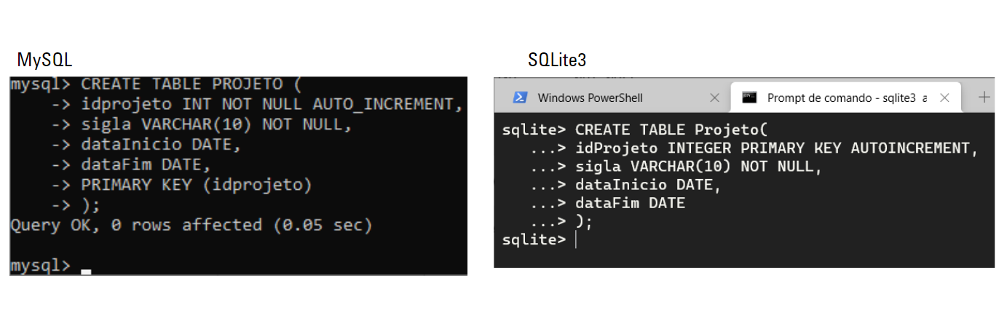
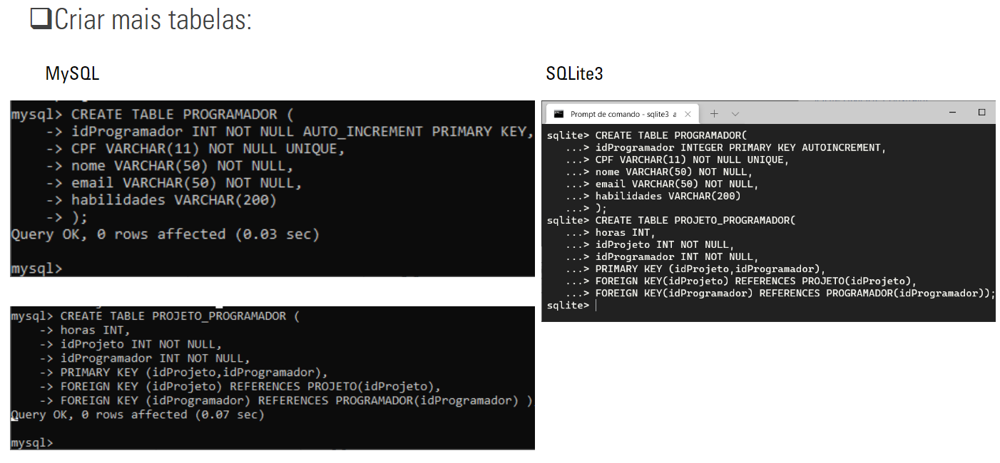
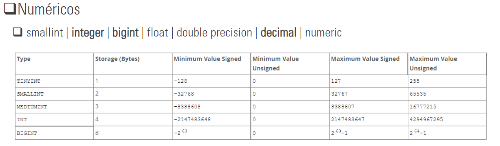
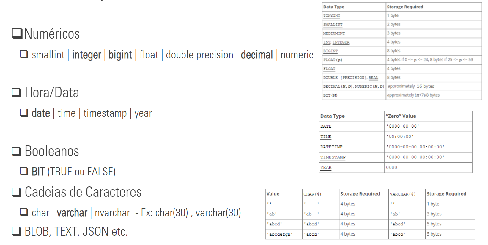
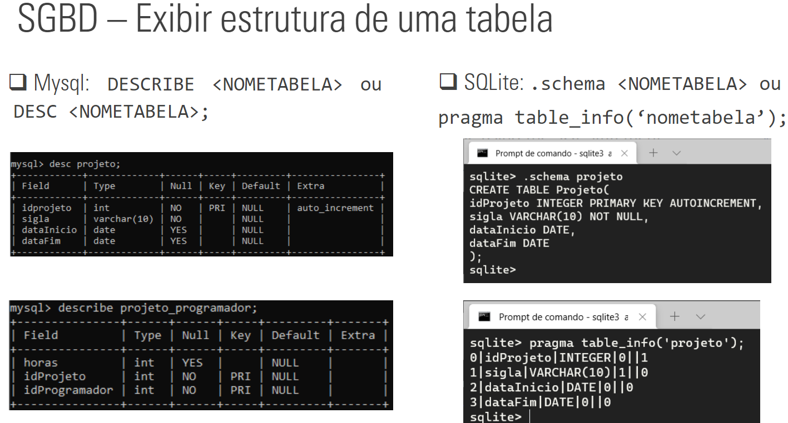
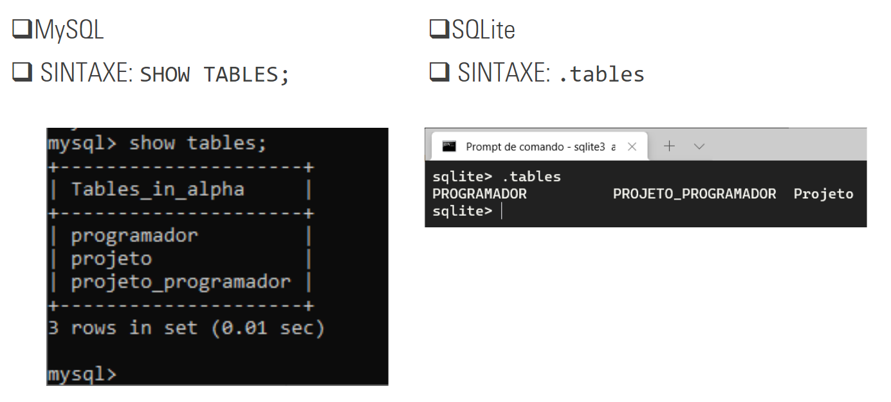

# SGBD – Linguagens

####DDL:
- Data Definition Language – Linguagem de Definição de Dados
  - Comandos para a definw 55w 57 ição,modificação e remoção de estruturas e relacionamentos de tabelas.

####DML:
- Data Modification Language – Linguagem de Manipulação de Dados
  - Para realizar consultas(Queries), alterações(Update), inclusões(Insert) e exclusões(Delete) de registros.
---
## SGBD – SQL

#### Structured Query Language - SQL

- Permite executar comandos DDL e DML de forma simplificada.

---
### SGBD – CREATE DATABASE/SCHEMA

- Cria uma base de dados que pode agrupar várias estruturas (ex:tabelas, views, etc.)
- No padrão SQL é possível ainda atribuir um usuário que terá acesso a tal agrupamento.

      CREATE SCHEMA ALPHA AUTHORIZATION‘JSilva’;
---

### SGBD – CREATE TABLE

---

### SGBD – Tipos de Dados

---

### SGBD - Exibir estrutura de uma tabela

---

### SGBD - Exibir todas as tabelas de uma base de dados

