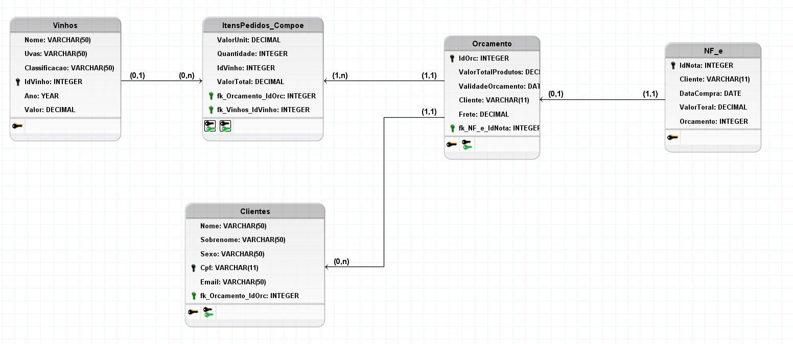

FIAP – Cognitive Data Science - Checkpoint #1

Entrega: 13/04/2021 até o meio-dia

Local: MS Teams

1) Cite ao menos uma vantagem em usar um sistema gerenciador de banco de dados (SGBD) relacional
em comparação com bancos de dados tradicionais (ex: hierárquico, de arquivos). 
O que são as propriedades ACID em um banco de um SGBD relacional? (2 pontos)

Uma das vantagems de se usar um SGBD é a praticidade de poder acessar um mesmo arquivo em diferentes máquinas sem ter perda de dados ou dados duplicados,
em um ambiente corporativo, podemos ter uma lista de produtos com seus respectivos preços, e uma serie de vendedores tendo que acessar e atualizar a mesma lista ao mesmo tempo,
não usar um SGBD aumenta consideravelmente as chances de acontecer uma venda com alguma informacao equivocada.

As Propriedades de ACID de transação de um SGBD:
• Atomicidade = operações são executadas completamente ou canceladas/não executadas
• Consistência = mantém a consistência do estado dos dados inseridos, podendo apenas ser salvos dados válidos
• Isolamento = operações são executadas de forma independente de outras
• Durabilidade = mesmo persistindo dados com falhas, é possível recuperá-los

2) Apresente o modelo conceitual criado no BRmodelo para atender à seguinte necessidade de negócio: (3 pontos)
```
A vinícola Bacos deseja armazenar informações de seus diferentes tipos de vinhos, assim como os vinhos adquiridos por cada cliente e a nota fiscal emitida a cada venda. Uma nota fiscal pode ter vários itens pedidos (vinhos) e diferentes quantidades.

Para cada vinho, deverão ser armazenados:
•	Identificador do vinho, Nome do vinho, ano da safra, classificação (ex: tinto, seco, suave) do vinho, tipos de uvas utilizadas e valor de venda.

Para os clientes, deverão ser armazenados:
•	Nome, sobrenome, sexo, cpf e email

Para cada item pedido, deverão ser armazenados:
•	Identificador do item, vinho adquirido, quantidade e o valor unitário

Para a nota fiscal, deverão ser armazenados:
•	Número da nota, cliente que comprou, data da compra e o valor total da compra
```


3) Apresente o modelo lógico criado no BRmodelo, com as chaves primárias, secundárias e tipos de dados para atender à seguinte necessidade de negócio da empresa Bacos: (3 pontos)


4) Apresente o modelo físico criado no SQLite ou no Mysql. Exiba o schema das tabelas criadas: (2 pontos)


