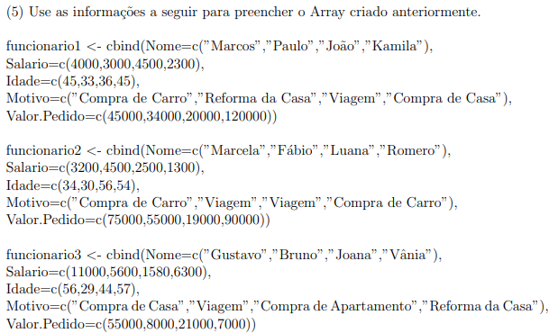

# Lista 3 (ver.2)

### 1 - c


### 2 - b


### 3 - 

```python
A<- matrix(0,4,5)

names_col<-c("Nome","Salario","Idade","Motivo do Emprestimo","Valor Solicitado")
nomes_linhas<- c('Cliente1','Cliente2','cliente3','cliente4')

array(A,dim = c(4,5,3),dimnames = list(nomes_linhas,names_col))
```

### 4 - 


```python
nomes_variaveis<-c('Nome', 'Salario', 'Idade', 'Motivo do Emprestimo' , 'Valor Solicitado')
nomes_matrizes<-c('Funcionario 1 - Melissa M.' , 'Funcionario 2 - Carlos P.' , 'Funcionario - 3 Luciana T.') 
nomes_linhas<- c('Cliente1','Cliente2','cliente3','cliente4') 

B <- array(0,dim = c(4,5,3),dimnames = list(nomes_linhas,nomes_variaveis,nomes_matrizes))

```

### 5 - 



```python
Nome = c('Marcos','Paulo','Joao','Kamila')
Salario = c(4000,3000,4500,2300)
Idade = c(45,33,36,45)
Motivo = c('Compra de Carro','Reforma da Casa','Viagem','Compra de Casa')
Valor.Pedido = c(45000,34000,20000,120000)

B[,,1] <-  cbind(Nome,Salario,Idade,Motivo,Valor.Pedido)

Nome = c('Marcela','Fabio','Luana','Romero')
Salario = c(3200,4500,2500,1300)
Idade = c(34,30,56,54)
Motivo = c('Compra de Carro','Viagem','Viagem','Compra de Carro')
Valor.Pedido = c(75000,55000,19000,90000)

B[,,2] <-  cbind(Nome,Salario,Idade,Motivo,Valor.Pedido)

Nome = c('Gustavo','Bruno','Joana','Vania')
Salario = c(11000,5600,1580,6300)
Idade = c(56,29,44,57)
Motivo = c('Compra de Casa','Viagem','Compra de Apartamento','Reforma da Casa')
Valor.Pedido = c(55000,8000,21000,7000)

B[,,3] <-  cbind(Nome,Salario,Idade,Motivo,Valor.Pedido)
```

### 6 - 

```python
> sum(as.numeric(B[,2,1]))
[1] 13800
> sum(as.numeric(B[,2,2]))
[1] 11500
> sum(as.numeric(B[,2,3]))
[1] 24480

#funcionario 3 = mais feliz
```


