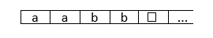
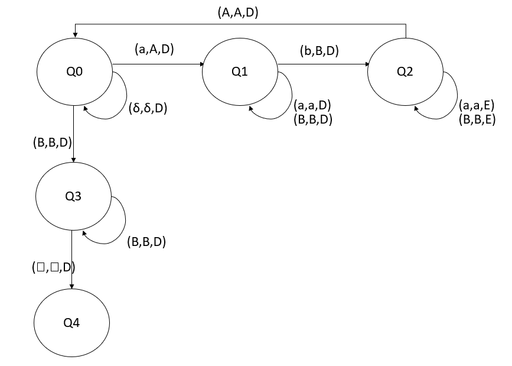
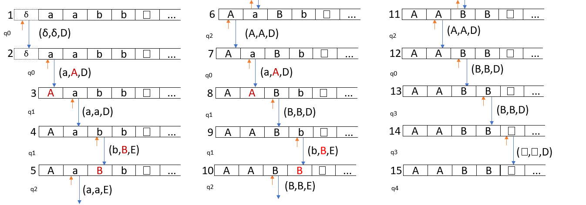

# Maquina de Turing

- Fita suficientemente grande (infinita) organizada em células.
Essa fita representa a memoria.

- Tem um cabecalho que indica o inicio da fita, que fica a esquerda.

- Pode andar pra direita ou voltar para a esquerda ate o seu ponto inicial.

- Pode ler, escrever um caractere e se move para direita ou esquerda.

## Em cada interacao:
1. Ler o caracter da fita.
2. Escrever o caracter (pode ser o mesmo ou diferente do atual).
3. Se mover para a direita ou esquerda.
4. Quando encontra condicao satisfatoria (aceitacao/rejeicao), encerra os calculos.

## Exemplo 1

Seja um fita com os seguintes caracteres:

Faça um automato que transforme aabb para AABB:

 
-
