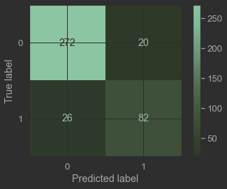
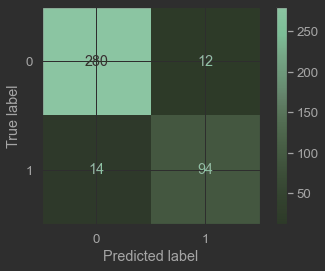

# **Global Solution:** Redes Neurais

- RM 94199 - Matias Cornelsen Herklotz
- RM 93821 - Gustavo Jordão Santos
- RM 94026 - Daniel Faria de Barros

---

## **Parte 1** - Como Redes Neurais e Deep Learning têm auxiliado a aprimorar o reconhecimento de dados biométricos?

O que são dados biométricos?
Caracterizam-se como dados biométricos todos aqueles que identificam de forma individual, única e exclusivamente uma 
pessoa natural. 

Um dado biométrico, portanto, é aquele que quando relacionado às características físicas ou comportamentais apresenta 
potencial de identificação do indivíduo. Lembrando, por oportuno, que biometria não se resume à impressão digital, 
abrangendo também a utilização de íris, face, voz e outras técnicas desde que sejam capazes de identificar as pessoas 
de forma única.
Irregularidade na coleta de dados biométricos

Em 2018, o Instituto Brasileiro de Defesa do Consumidor (IDEC) ajuizou uma ação pública solicitando a remoção das câmeras 
instaladas pela concessionária ViaQuatro, responsável pela operação do trajeto da linha 4-Amarela do metrô de São Paulo (SP).
A concessionária vinha coletando, por meio das câmeras, dados biométricos e a emoção dos usuários daquele trajeto.

Esses dados faziam parte de um experimento da ViaQuatro voltado para fins publicitários, do qual já participavam as 
empresas LG e HyperaPharma. O reconhecimento facial dos cidadãos, coletado pelas chamadas “portas interativas digitais”,
era utilizado para identificar sua resposta à publicidade ou informes exibidos no display. Ainda, dados como faixa 
etária e gênero também eram coletados.

Em 2019, o IDEC também notificou o banco Itaú e a Quod, administradora de dados financeiros, após anunciarem a adoção 
de nova tecnologia de reconhecimento facial para cadastramento de clientes. As empresas pretendiam utilizar os dados 
biométricos como exigência para aprovação e liberação de crédito aos clientes (Itaú) e, até mesmo, como condição de 
acesso ao aplicativo (Quod), a fim de confirmar a identidade do consumidor.

---

## **Parte 2** - Modelagem preditiva: este candidato ganharia a eleição? 

### Metricas
Em cada modelo, foi levantadas 4 metricas, Acuracia, Precisão, Recall e F1-Score. Com a ajuda da observação
dos graficos, constatamos que dentre o total de candidatos, existiam mais não eleitos do que candidatos eleitos, Percebemos que nao seria
eficaz se basear na pontuação de Acuracia, e como queriamos uma metrica balanceada, decidimos nos basear principalmente
no F1-Score.

---

### Modelos ML
#### Modelo Tree
O modelo não possui Hyperparâmetros.

| Accuracy | Recall | Precision | **F1_score** |
|----------|--------|-----------|--------------|
|  0.88    | 0.74   | 0.78      | **0.76**     |

---

#### Modelo Forest
Utilizamos a função *for* para poder testar varios numeros diferentes de *estimators*.

E o numero com a maior pontuação foi de 51:

| Accuracy | Recall | Precision  | **F1_score** |
|----------|--------|------------|--------------|
| 0.93     | 0.83   | 0.90       | **0.87**     |

Já podemos ver uma melhora significante na pontuação de F1-Score.

---

#### Modelo KNN

Assim como o modelo Forest, utilizamos a função *for* para poder testar diversos numeros de *neighbors*.

E o numero com a maior pontuação foi de 5:

| Accuracy | Recall | Precision  | **F1_score** |
|----------|--------|------------|--------------|
| 0.88   | 0.75  | 0.80       | **0.78**     |

Podemos notar uma relativa piora, em comparação com o modelo anterior, 
porém, uma pontuaçao melhor que o primeiro modelo.

---

#### Modelo KNN com os dados escalados

Utilizamos o processo do Sklearn MinMaxScaler, para poder escalar os dados do DF, utilizamos a mesma
estrategia do modelo anterior, e o melhor numero de *neighbors* foi 15.

| Accuracy | Recall | Precision | **F1_score** |
|----------|--------|-----------|--------------|
| 0.92     | 0.79   | 0.90      | **0.84**     |

Coseguimos notar uma melhora em relacao ao modelo anterior, porem o modelo Forest 
continuou com a maior pontuação geral.

---

### Modelos RN

#### Modelo Perceptron

O modelo não possui Hyperparâmetros.

| Accuracy | Recall | Precision | **F1_score** |
|----------|--------|-----------|--------------|
| 0.89     | 0.76   | 0.80      | **0.78**     |

Podemos ver que o modelo possui um desempenho similar ao modelo KNN.

---

#### Modelo MLP

O nosso primeiro modelo MLP manteve a maioria de seus Hyperparâmetros em *default*.

Com exceção das camadas ocultas, que colocamos uma camada com 5 neuronios, e do numero de épocas,
que deixamos 500 pois a partir desse ponto modelo nao apresenta melhora significativa.

| Accuracy | Recall | Precision | **F1_score** |
|----------|--------|-----------|--------------|
| 0.89     | 0.80   | 0.80      | **0.80**     |

---

#### Modelo MLP com os dados escalados

Utilizamos novamente o processo do Sklearn MinMaxScaler, assim como no segundo modelo de KNN

E no nosso Segundo modelo MLP definimos os seguintes Hyperparâmetros:

- Hidden layers:  1 camada com 1 neuronio, foi a estrutura que apresnetou maior pontuação;

- Activation: identity, o relu apresentou baixo desempenho, e o logistic simplesmente nao funcionou com nosso modelo,
ficamos entre identity e tanh que apresentaram resultado muito similar;
- Solver: sgd, lbfgs foi o solver que apresentou pior desempenho, e ficamos entre sgd e adam porque ambos apresentaram 
o mesmo resultado;
- Learning rate: Adaptive, pois se o modelo nao progredir de uma epoca para outra, ele ira automaticamente reduzir o 
learning rate.

| Accuracy | Recall | Precision | **F1_score** |
|----------|--------|-----------|--------------|
| 0.94     | 0.87   | 0.89      | **0.88**     |

---

### Resultado Geral

| Modelo     | Accuracy | Recall | Precision | **F1_score** |
|------------|----------|--------|-----------|--------------|
| Tree       | 0.88     | 0.74   | 0.78      | **0.76**     |
| Forest     | 0.93     | 0.83   | 0.90      | **0.87**     |
| KNN        | 0.88     | 0.75   | 0.80      | **0.78**     |
| KNN_Scaled | 0.92     | 0.79   | 0.90      | **0.84**     |
| Perceptron | 0.89     | 0.76   | 0.80      | **0.78**     | 
| MLP        | 0.89     | 0.80   | 0.80      | **0.80**     |  
| MLP_Scaled | 0.94     | 0.87   | 0.89      | **0.88**     |       

---

## Conclusão:

Apos analisar os dados, ler os graficos e modelar o problema utilizando diversos algoritimos, chegamos
a conclusão que a base de dados, apesar de nao ser apropriada para a implementação de algoritimos de ML,
tivemos ótimos resultados com quase todos os modelos.

O Modelo com melhor desempenho, foi o modelo de MLP com os dados Escalados, e com os Hyperparâmetros editados.
Seu F1-Score chegou a pontuação de 0.88, e mesmo assim, poderiamos ter chegado em resultados mais apropriados.
Possivelmente com uma melhor interpretaçao dos dados, ou com uma escolha melhor de modelos e Hyperparâmetros,
Nossa pontuação seria ainda maior.
