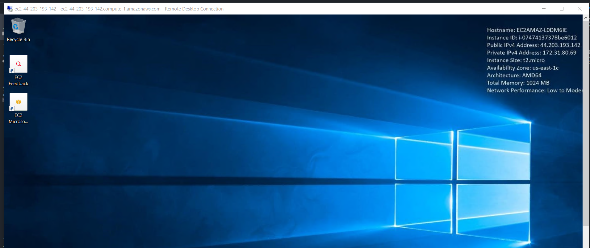
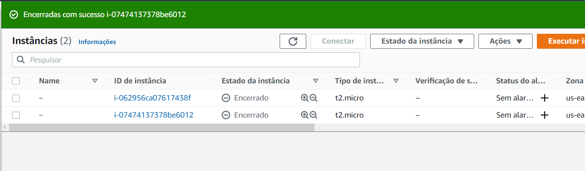

# FIAP – Checkpoint #1

####Entrega: 14/04/2022

####Local: MS Teams

---
**1. O que são regiões e zonas de disponibilidade (AZ)? Explique para que serve o AWS IAM? Para que serve o AWS CLI? (3 pontos)**

a) Uma zona de disponibilidade (AZ) é um ou mais datacenters distintos com energia, rede e conectividade redundantes em uma região da AWS.
As AZs proporcionam aos clientes a capacidade de operar aplicativos e bancos de dados de produção com alta disponibilidade, 
tolerância a falhas e escalabilidade em níveis superiores aos que um único datacenter pode oferecer. 

b) O AWS Identity and Access Management (IAM) fornece controle de acesso refinado em toda a AWS. Com o IAM, é possível 
especificar quem pode acessar quais serviços e recursos e em que condições. Com as políticas do IAM, você gerencia 
permissões para seu quadro de funcionários e sistemas para garantir permissões com privilégios mínimos.

c) A AWS Command Line Interface (AWS CLI) é uma ferramenta de código aberto que permite interagir com os serviços da 
AWS usando comandos no shell da linha de comando. Com o mínimo de configuração, a AWS CLI permite começar a executar 
comandos que implementam uma funcionalidade equivalente àquela fornecida pelo AWS Management Console baseado em navegador 
do prompt de comando em seu programa de terminal

---

**2. Cite e descreva uma vantagem em armazenar dados na nuvem? Cite um serviço de computação em nuvem (2 pontos)**

a) Armazenar dados de uma forma segura e pratica, pode acessar e guardar dados na nuvem de qualquer lugar do mundo,
com qualquer computador ou plataforma, alem de garantir a seguranca no sentido de evitar guardar informações inportantes
em locais fisicos sujeitos as adversidades do dia a dia.

b) Google. O Google utiliza a computação em nuvem para armazenar seus dados, seja na busca por algo na internet, 
carregar uma imagem entre outros, esses dados foram carregados através da nuvem

---

**3. Explique, com suas palavras, para que serve o serviço AWS EC2? Apresente uma cotação para uma instância que usa o
Linux na região de São Paulo, com uma máquina com 4 CPUs, 32 GB de Memória e 30GB SSD de uso geral (gp2). (2 pontos)**

a) O Amazon EC2, conhecido como Amazon Elastic Compute Cloud, apresenta uma capacidade de computação escalável no serviço 
de Nuvem da Amazon, conhecido como Amazon Web Services (AWS). A utilização do serviço da Amazon, EC2, substitui a necessidade 
de investimento a curto prazo em hardware, portanto, você pode desenvolver e implantar aplicativos com mais rapidez e praticidade. 
É um recurso extremamente volatil, pois permite executar quantos servidores virtuais forem necessários, aumentar ou reduzir a 
escala para lidar com alterações nos requisitos ou com picos em popularidade, reduzindo sua necessidade de prever o tráfego.

b)

---
**4. Crie uma instância gratuita (t2.micro) com Windows Server 2019 Base no EC2. Acesse-o via remote desktop (RDP).
Dê um print ao acessar a instância. Encerre a instância e dê um print das instâncias (incluindo as encerradas) (3 pontos)**

