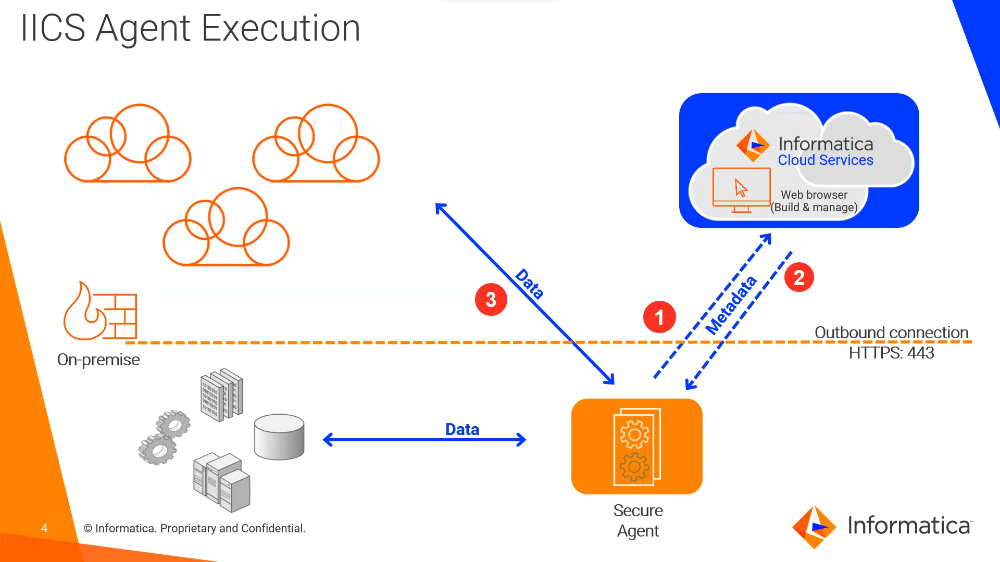

# Repository Manager

- Create foulder
- Manage permitions
- Import and Exports Metadata

### Path

#### Create Project

Data Integration > Explore > New Project 

#### Create Foulder

Data Integration > Explore > Project > New Foulder

#### Permitions

Data Integration > Explore > Project > Foulder > Asset > Permissions

#### Filter 

Data Integration > Explore > Project > Foulder > Filter Icon

#### Export Metadata

Data Integration > Explore > Project > Foulder or Asset > Export
Then
Data Integration > My Imports/Exports Logs > Export

#### Import Metadata

Data Integration > Explore > Import                               

# > IICS x PowerCente

PowerCenter is a client server based product X IICS is a native cloud offer 

Just need a browser to use IICS!

## >> Login

In IICS, each login is assosiated to an org, and an org is an equivalent of a powercenter repo

## >> Administrator Service

- New repo
- Select user, groups and roles

## >> Data Integration Service

- Dashboard with overview of enviroement
- Maping
- Sections
- WorkFlows

### >>> Explore

- Projects in org

#### >>>> Project

- see Foulder in it
- add Foulder
- remove Foulder

##### >>>>> Foulder

- see assets

### >>> New

- Create Mapping
- Mapping templates
- Create TaskFlow
- TaskFlow templates 

#### >>>> Creating a new Mapping

- Mapping canvas
- Transformations options
- New Mapping task

### >>> My Jobs

- See Status of anything schedule 

## >> Monitor Service

- Status of anything running

# IICS Component Architecture

## Informatica Cloud Service

- Metadata Repository
- Hosted, Multi-Tenant
- Managed by informatica
- Browser User Interface

## Informatica Secure Agent

- Execution Control
- Self-Updating
- Cloud, On-premise, or hosted
- No Data Storage

## Example:

# Glossario

### O que é Power Center

PowerCenter é uma plataforma de integração de dados desenvolvida pela Informatica. É utilizado por empresas para integrar, gerenciar e compartilhar dados em vários sistemas, aplicativos e fontes de dados, incluindo bancos de dados relacionais, arquivos, sistemas cloud e muito mais.

Com o PowerCenter, os dados podem ser capturados, limpados, transformados e carregados em uma única fonte centralizada, permitindo que as empresas obtenham umavisão única e consistente dos dados em sua organização. Isso ajuda a melhorar a tomada de decisão e a eficiência dos processos empresariais. Além disso, o PowerCenter oferece ferramentas avançadas de monitoramento e gerenciamento de desempenho para garantir a qualidade e a integridade dos dados integrados.

### O que é IICS?

Informatica Intelligent Cloud Services (IICS) é uma plataforma de integração de dados baseada em nuvem desenvolvida pela Informatica. Ele permite que as empresas integrem, gerenciem e compartilhem dados em vários sistemas, aplicativos e fontes de dados, incluindo bancos de dados, aplicativos SaaS, nuvens públicas e privadas e muito mais.

Com o IICS, as empresas podem automatizar processos de integração de dados em larga escala, aproveitando a flexibilidade, escalabilidade e segurança da nuvem. Além disso, o IICS oferece uma ampla gama de ferramentas de integração, incluindo integração de aplicativos, integração de dados, gerenciamento de metadados, análise de dados e inteligência artificial. Isso ajuda as empresas a obter uma visão única e consistente dos dados em sua organização, melhorando a tomada de decisão e a eficiência dos processos empresariais.

### O que é um Mapping no IICS?

Em Informatica Intelligent Cloud Services (IICS), um mapping é um diagrama que representa a transformação de dados de uma fonte para uma destinação. Ele é usado para definir as regras de transformação e as relações entre os campos de dados.

Um mapping pode incluir várias etapas, como filtragem de dados, conversão de tipos de dados, agregação de dados, junção de dados e muito mais. Cada uma dessas etapas é representada por um objeto gráfico no mapping, que pode ser configurado e personalizado para atender às necessidades específicas de cada projeto.

Os mappings são usados para integrar dados de diferentes fontes e destinações, e são uma parte importante do processo de integração de dados no IICS. Eles permitem que as empresas automatizem e otimizem a integração de dados, ajudando a melhorar a qualidade e a consistência dos dados em sua organização.

### Um Mapping pode ser considerado um Pipeline?

Sim, um mapping no Informatica Intelligent Cloud Services (IICS) pode ser considerado como um pipeline de processamento de dados. Um pipeline é uma seqüência de etapas que são executadas em série para transformar dados de uma fonte para uma destinação. Em um pipeline de processamento de dados, cada etapa realiza uma tarefa específica, como filtrar dados, converter tipos de dados, agregar dados, junção de dados, entre outras.

O mapping no IICS é uma representação gráfica do pipeline de processamento de dados, onde cada etapa é representada por um objeto gráfico e as relações entre as etapas são representadas por conexões entre os objetos. O mapping permite que você configure e personalize as etapas para atender às suas necessidades específicas.

Portanto, um mapping no IICS pode ser considerado como um pipeline de processamento de dados, pois representa a seqüência de etapas que são executadas para transformar dados de uma fonte para uma destinação.

### O que é Mapping Task?

Em Informatica Intelligent Cloud Services (IICS), um Mapping Task é uma tarefa que representa uma etapa de transformação de dados em um pipeline de processamento de dados. Ele é usado para transformar dados de uma fonte para uma destinação específica, como um banco de dados ou um arquivo.

Um Mapping Task é baseado em um mapping, que é uma representação gráfica das regras de transformação e das relações entre os campos de dados. O Mapping Task executa as regras de transformação definidas no mapping para transformar os dados de entrada em dados de saída.

Os Mapping Tasks são executados em um ambiente de processamento de dados, que é responsável por ler os dados de entrada, executar as regras de transformação e escrever os dados de saída. Eles são uma parte importante do processo de integração de dados no IICS, pois permitem que as empresas automatizem e otimizem a transformação de dados.

Em resumo, um Mapping Task é uma tarefa que representa uma etapa de transformação de dados em um pipeline de processamento de dados, executada com base em regras definidas em um mapping.

### O que é um TaskFlow?

No Informatica Intelligent Cloud Services (IICS), um taskflow é uma sequência lógica de tarefas que são executadas em ordem para realizar uma integração de dados específica. Um taskflow pode incluir tarefas como extração de dados de fontes, transformação de dados, carregamento de dados em destinos, entre outras.

Os taskflows são criados usando a ferramenta de design do IICS, onde você pode arrastar e soltar tarefas em uma superfície de trabalho e definir as dependências entre elas. Você também pode adicionar controle de fluxo, como condições e loops, para controlar o fluxo de dados e a execução de tarefas.

Os taskflows são executados como trabalhos, que são instâncias de um taskflow que foram agendadas para execução. Você pode agendar trabalhos para serem executados uma vez, periodicamente ou a partir de eventos específicos.

Em resumo, um taskflow no IICS é uma sequência lógica de tarefas que são executadas em ordem para realizar uma integração de dados específica. Eles são criados usando a ferramenta de design do IICS e são executados como trabalhos.

### Qual a diferença entre Mapping e Taskflow?

Em Informatica Intelligent Cloud Services (IICS), um mapping e um taskflow são conceitos diferentes que servem para propósitos diferentes na integração de dados.

Um mapping é uma representação gráfica das regras de transformação que são aplicadas aos dados de entrada para produzir dados de saída. Ele define como os campos de entrada são convertidos em campos de saída, incluindo operações como agregação, filtragem, junção, entre outras. Um mapping é executado por uma tarefa de mapping, que é uma etapa do processo de integração de dados.

Já um taskflow é uma sequência lógica de tarefas que são executadas em ordem para realizar uma integração de dados específica. Ele pode incluir tarefas como extração de dados de fontes, transformação de dados, carregamento de dados em destinos, entre outras. Um taskflow pode incluir uma ou mais tarefas de mapping, mas também pode incluir outras tarefas, como tarefas de processamento de arquivos, tarefas de banco de dados, entre outras.

Em resumo, a diferença entre um mapping e um taskflow no IICS é que um mapping é uma representação gráfica das regras de transformação de dados, enquanto um taskflow é uma sequência lógica de tarefas que são executadas em ordem para realizar uma integração de dados específica.

### O que é um Parametro

Em Informatica Intelligent Cloud Services (IICS), um parâmetro é uma variável usada em um mapeamento que pode ser definida em tempo de execução. Esses parâmetros permitem que você altere o comportamento de um mapeamento sem precisar editá-lo manualmente. Eles são úteis em situações em que o comportamento de um mapeamento precisa ser modificado com base em condições específicas, sem ter que criar múltiplos mapeamentos para cada situação.

Por exemplo, você pode criar um mapeamento que inclua um parâmetro para especificar o intervalo de datas para extração de dados. Durante a execução, você pode passar o valor desse parâmetro para o mapeamento, especificando o intervalo de datas que deseja extrair. Isso permite que você execute o mesmo mapeamento várias vezes com diferentes intervalos de datas sem ter que criar mapeamentos separados.

Você pode criar parâmetros no IICS usando a ferramenta de criação de mapeamentos. Eles são definidos como variáveis com tipos de dados específicos, como inteiros, datas ou strings, e são passados como argumentos durante a execução do mapeamento.

Em resumo, os parâmetros em um mapeamento no IICS são variáveis usadas para controlar o comportamento do mapeamento em tempo de execução. Eles são úteis para personalizar o comportamento de um mapeamento sem precisar editá-lo manualmente, permitindo que você execute o mesmo mapeamento várias vezes com diferentes configurações.

### O que é PowerCenter Component Architecture Review ?

A revisão da arquitetura dos componentes do PowerCenter é o processo de avaliar e atualizar a estrutura atual dos componentes do PowerCenter para atender às necessidades atuais e futuras de integração de dados. Isso envolve avaliar as configurações atuais, processos e ferramentas, bem como identificar oportunidades de otimização, atualização ou substituição de componentes.

A revisão da arquitetura dos componentes do PowerCenter pode incluir a avaliação de componentes como:

-  Servidor de Repositório: para garantir que está funcionando corretamente e oferecendo as funcionalidades necessárias
-  Servidor de Integração: para verificar a eficiência de processamento de dados
-  Ferramentas de Mapeamento: para avaliar a eficiência e funcionalidade das regras de transformação de dados
-  Ferramentas de Workflow: para avaliar a eficiência e funcionalidade dos processos de ETL
-  Ferramentas de Monitoramento: para verificar a capacidade de monitorar e gerenciar o processo de integração de dados

A revisão da arquitetura dos componentes do PowerCenter é realizada por especialistas em integração de dados que trabalham com a organização para entender suas necessidades atuais e futuras e desenhar uma solução que atenda a essas necessidades. O objetivo é criar uma arquitetura escalável, confiável e eficiente que ajudará a organização a realizar integrações de dados de forma mais rápida e eficiente.

### O que é IICS Component Architecture

A arquitetura de componentes do Informatica Intelligent Cloud Services (IICS) é uma estrutura de componentes interconectados que trabalham juntos para fornecer as funcionalidades de integração de dados, governança de dados, análise de dados e gerenciamento de dados da plataforma. Cada componente tem uma função específica e trabalha em conjunto com outros componentes para fornecer uma solução completa e integrada.

Os componentes da arquitetura de componentes do IICS incluem, mas não se limitam a:

- Informatica Data Integration: permite a integração de dados de vários sistemas e fontes, incluindo sistemas de nuvem, sistemas on-premises e aplicativos de software como service (SaaS).

- Informatica Data Governance: oferece recursos de governança de dados, como definição de políticas, gerenciamento de metadados e conformidade regulatória.

- Informatica Data Quality: ajuda a garantir que os dados sejam precisos, completos e consistentes, oferecendo recursos de validação, correção e melhoria de dados.

- Informatica Big Data Management: permite a integração de dados em grande escala e a análise de dados não estruturados, como dados de log e dados de mídia social.

A arquitetura de componentes do IICS é projetada para oferecer uma solução completa e integrada para as necessidades de integração de dados, governança de dados, análise de dados e gerenciamento de dados das empresas. Isso permite que as empresas implementem soluções de maneira rápida e eficiente, com uma estrutura de componentes confiável e testada.

### O que é Informatica Secure Agent

Informatica Secure Agent é uma ferramenta da Informatica que permite a integração de dados em sistemas on-premises e cloud. É usado para estabelecer conexões seguras e confiáveis com fontes de dados em diferentes sistemas e locais, permitindo a transferência de dados de forma segura e eficiente.

O Informatica Secure Agent é projetado para garantir a segurança dos dados durante a transferência, usando criptografia e autenticação forte. Além disso, o Informatica Secure Agent é fácil de gerenciar e pode ser configurado para trabalhar de forma autônoma, sem intervenção manual. Isso ajuda a garantir que a integração de dados seja rápida, eficiente e confiável, sem prejudicar a segurança dos dados.

O Informatica Secure Agent é uma parte importante da plataforma de integração de dados da Informatica, ajudando as empresas a integrar dados de diferentes sistemas e fontes de maneira segura e confiável. Isso permite que as empresas obtenham insights valiosos a partir de seus dados e melhorem a eficiência dos processos de negócios.

### O que é Metadata

Metadados são informações sobre outros dados. Eles descrevem as características, propriedades e relações de outros dados, mas não incluem os dados em si. Por exemplo, metadados podem incluir informações como o tipo de dados, a data de criação, o autor, a fonte dos dados, entre outros. Estas informações são importantes porque ajudam a entender, organizar, gerenciar e proteger os dados. Em sistemas de gerenciamento de banco de dados, os metadados são armazenados separadamente dos dados para garantir a integridade e segurança dos dados.

### O que é Metadata Repository
Um repositório de metadados é um sistema de gerenciamento de dados que armazena informações sobre outros sistemas de dados e suas estruturas. O repositório de metadados é usado para documentar e gerenciar informações sobre os dados em um sistema, incluindo sua estrutura, relações, definições de campo e regras de negócios.

Os repositórios de metadados são importantes porque ajudam a garantir a qualidade dos dados e a consistência de sua estrutura, bem como a integridade dos processos de negócios que dependem desses dados. Eles também ajudam a facilitar a governança de dados, tornando mais fácil identificar e resolver problemas relacionados aos dados.

Além disso, os repositórios de metadados são úteis para a integração de dados, pois fornecem informações sobre as fontes de dados e suas estruturas, facilitando a integração de dados de diferentes sistemas. Eles também ajudam a garantir a consistência dos dados durante a integração, pois ajudam a identificar e corrigir quaisquer discrepâncias entre as fontes de dados.

Em resumo, um repositório de metadados é uma ferramenta importante para garantir a qualidade e a integridade dos dados em um sistema, bem como para facilitar a integração de dados e a governança de dados.

### O que é Multi-Tenant

Multi-Tenant é um modelo de arquitetura de software que permite que vários clientes compartilhem uma única instância de aplicativo ou infraestrutura. Em vez de cada cliente ter uma instância separada do software, todos os clientes compartilham a mesma instância, com recursos isolados para garantir que as informações de um cliente não sejam acessadas por outro cliente.

O modelo Multi-Tenant é muito comum em software como serviço (SaaS) e plataformas em nuvem, onde é possível fornecer serviços a vários clientes a partir de uma única instância do software. Isso permite aos provedores de serviços fornecer soluções escaláveis, eficientes e acessíveis a vários clientes, sem precisar fornecer uma instância separada do software para cada cliente.

Vantagens do modelo Multi-Tenant incluem redução de custos, pois é possível compartilhar recursos e infraestrutura, e facilidade de gerenciamento, pois é possível gerenciar vários clientes a partir de uma única instância do software. Além disso, o modelo Multi-Tenant é muito eficiente em termos de recursos, pois permite compartilhar recursos e otimizar o uso de hardware e infraestrutura.

Em resumo, o modelo Multi-Tenant é uma arquitetura de software que permite que vários clientes compartilhem uma única instância de aplicativo ou infraestrutura, oferecendo vantagens em termos de eficiência, escalabilidade, acessibilidade e gerenciamento de custos.

### O que é On-premise?

On-premise é uma arquitetura de software que significa que o software é instalado e executado localmente, em equipamentos próprios da organização. Em outras palavras, a organização compra o software e o instala em seus próprios servidores, em vez de acessá-lo através da nuvem ou de um provedor externo.

O modelo On-premise é contrastado com o modelo de software como serviço (SaaS), em que o software é acessado através da nuvem e é gerenciado pelo provedor.

O modelo On-premise oferece mais controle sobre o software e a infraestrutura, bem como mais privacidade e segurança dos dados, pois a organização mantém os dados e os recursos internamente. Além disso, o modelo On-premise é ideal para organizações que precisam de personalização e integração avançadas, que não são possíveis com soluções baseadas na nuvem.

No entanto, o modelo On-premise também pode ser mais caro e requerer mais esforço para gerenciar, pois a organização precisa manter a infraestrutura e garantir a disponibilidade do software. Além disso, o modelo On-premise pode ser menos escalável do que soluções baseadas na nuvem, pois a organização precisa adquirir mais recursos internamente.

Em resumo, o modelo On-premise é uma arquitetura de software que significa que o software é instalado e executado localmente, em equipamentos próprios da organização, oferecendo mais controle, privacidade e segurança, mas também maiores custos e esforços de gerenciamento.

### O que é um conector

Em relação ao Informatica Intelligent Cloud Services (IICS), um conector é uma ferramenta que permite a conexão e integração de aplicações ou sistemas de dados diferentes com o IICS. Esses conectores podem ser usados para importar ou exportar dados, sincronizar informações entre aplicações, ou mesmo para integrar sistemas externos à nuvem com o IICS. Exemplos de conectores no contexto do IICS incluem conectores para aplicações como Salesforce, SAP, Oracle, entre outros. Eles possibilitam que você extraia, transforme e carregue dados de e para essas aplicações, sem precisar escrever códigos complexos.

### O que é CDI

CDI (Cloud Data Integration) funcionalidade é uma parte da plataforma Informatica Intelligent Cloud Services (IICS). Ele permite a integração de dados em nuvem, oferecendo recursos para coletar, transformar, integrar e carregar dados de diferentes fontes de dados em nuvem. O CDI permite a integração de dados em tempo real, batch e em fluxo, além de oferecer recursos avançados de gerenciamento de dados, como validação, limpeza e transformação de dados. Em resumo, a funcionalidade CDI é projetada para ajudar as empresas a aproveitar ao máximo seus dados em nuvem, tornando-os mais fáceis de acessar, integrar e utilizar.

### o que é Sincronization Task

A sincronização de tarefas é uma funcionalidade no Informatica Intelligent Cloud Services (IICS) que permite sincronizar dados entre diferentes fontes de dados. É uma tarefa programada que compara as informações existentes nas fontes de dados, identifica as diferenças e atualiza automaticamente as informações para manter a consistência dos dados. Isso é útil quando você precisa manter dados em sincronia em vários sistemas ou bancos de dados.   

### O que é Data Request

Levantamento da origem dos dados e suas regras para utilização final na area do negócio

As vezes as regras muda ou o Data Request está incompleto ou errado e tem que ser refeito, ja que ele é insumo para o desenvolvimento

